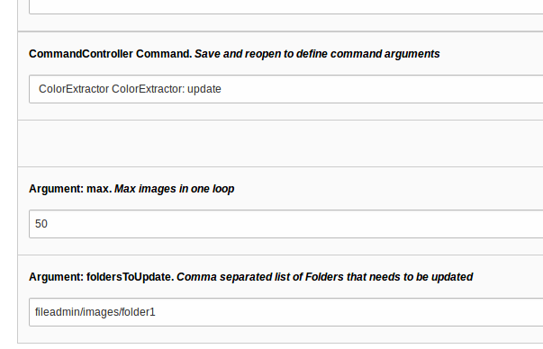

.. ==================================================
.. FOR YOUR INFORMATION
.. --------------------------------------------------
.. -*- coding: utf-8 -*- with BOM.

.. include:: ../Includes.txt

.. _admin-manual:

Administrator Manual
====================

Target group: **Administrators**

.. _admin-installation:

Installation
------------

Just Install the extension and make an image upload.
The metadata extraction is trigged after upload.

you can use a scheduler task / ExtbaseCommand Controller Task for existing images.

   View of Scheduler Task in BE (caption of the image)
