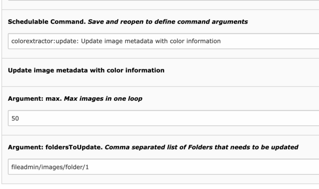

Introduction
============

.. _what-it-does:

What does it do?
----------------

This extension extracts colors from an image.
Based on the https://github.com/thephpleague/color-extractor

.. _screenshots:

Screenshots
-----------

This chapter should help people figure how the extension works. Remove it
if not relevant.

.. figure:: Documentation/Images/sysfile_metadata.png
   :width: 449px
   :alt: View in Backend

   View MetaData of an image Image

Administrator Manual
====================

Target group: **Administrators**

.. _admin-installation:

Installation
------------

Just Install the extension and make an image upload.
The metadata extraction is trigged after upload.

you can use a scheduler task /  "Execute console commands" for existing images.

   View of Scheduler Task in BE (caption of the image)

Users Manual
============

Target group: **Editors**

In the frontend you can use the colors, e.g. to create an individual picture frame,
or used the colors as a background color and use a lazyload for the pictures.
or for something complete different

To use the colors in the frontend, do the following

.. code-block:: html

	... Example 1
       

           <f:media class="image-embed-item" file="{file}" width="{dimensions.width}" height="{dimensions.height}" alt="{file.alternative}" title="{file.title}" />
       

   ... Example 2
       

           <f:media class="image-embed-item" file="{file}" width="{dimensions.width}" height="{dimensions.height}" alt="{file.alternative}" title="{file.title}" />
       

   ... Example 3
       

           <f:media class="image-embed-item" file="{file}" width="{dimensions.width}" height="{dimensions.height}" alt="{file.alternative}" title="{file.title}" />
       

   ... Example 4
       

           <f:media class="image-embed-item" file="{file}" width="{dimensions.width}" height="{dimensions.height}" alt="{file.alternative}" title="{file.title}" />
       

    ... Example 5
    

    <f:media class="image-embed-item" file="{file}" width="{dimensions.width}" height="{dimensions.height}" alt="{file.alternative}" title="{file.title}" />
  

   Examples preview
